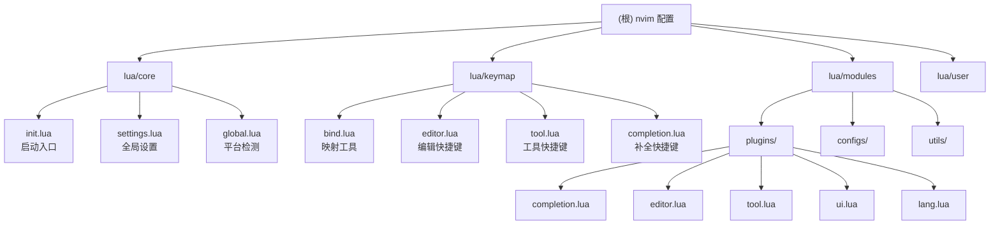

# 虞桀的 Neovim 配置

基于 [ayamir/nvimdots](https://github.com/ayamir/nvimdots) 的个人 Neovim 配置，支持 Neovim 0.11+ 稳定版。

## 项目愿景

打造一个快速、简洁、现代化、模块化的 Neovim 开发环境，启动时间小于 50ms，支持全栈开发。

## 架构总览

```
~/.config/nvim/
├── init.lua              # 入口文件（检测 VSCode 环境）
├── lua/
│   ├── core/             # 核心模块（初始化、全局变量、选项、设置、插件加载）
│   ├── keymap/           # 快捷键映射（分类管理）
│   ├── modules/          # 插件配置与工具函数
│   │   ├── configs/      # 插件配置（按类别分目录）
│   │   ├── plugins/      # 插件声明（lazy.nvim 格式）
│   │   └── utils/        # 工具函数
│   ├── user/             # 用户自定义配置（覆盖默认）
│   └── user_template/    # 用户配置模板
├── flake.nix             # NixOS 支持
└── .github/              # CI/CD 工作流
```

## 模块结构图



## 模块索引

| 模块 | 路径 | 职责 | 入口文件 |
|------|------|------|----------|
| 核心 | `lua/core/` | 初始化、全局变量、选项、插件加载 | `init.lua` |
| 快捷键 | `lua/keymap/` | 分类管理所有快捷键映射 | `init.lua` |
| 插件 | `lua/modules/` | 插件声明、配置、工具函数 | - |
| 用户 | `lua/user/` | 用户自定义配置（覆盖默认） | - |

## 运行与开发

### 环境要求

- Neovim 0.11+ 稳定版
- Git
- Nerd Font（推荐 JetBrainsMono Nerd Font）
- 可选：ripgrep、fzf、lazygit

### 安装

```sh
# Linux/macOS
bash -c "$(curl -fsSL https://raw.githubusercontent.com/ayamir/nvimdots/HEAD/scripts/install.sh)"

# Windows (PowerShell 7.1+)
Set-ExecutionPolicy Bypass -Scope Process -Force; Invoke-Expression ((New-Object System.Net.WebClient).DownloadString('https://raw.githubusercontent.com/ayamir/nvimdots/HEAD/scripts/install.ps1'))
```

### 常用命令

```vim
:Lazy              " 打开插件管理器
:Lazy sync         " 同步插件
:Mason             " 打开 LSP/DAP/格式化工具管理
:checkhealth       " 健康检查
:TSInstall <lang>  " 安装 Treesitter 解析器
```

## 测试策略

- 使用 GitHub Actions 进行代码风格检查（stylua）
- 依赖 `:checkhealth` 进行环境诊断
- 无单元测试框架

## 编码规范

- 纯 Lua 配置
- 使用 stylua 进行代码格式化
- 快捷键描述使用中文
- 插件按类别分组（completion/editor/lang/tool/ui）
- 用户自定义通过 `lua/user/` 目录覆盖

## AI 使用指引

### 关键文件快速定位

| 功能 | 文件路径 |
|------|----------|
| 全局设置（主题、LSP、格式化等） | `lua/core/settings.lua` |
| Neovim 选项 | `lua/core/options.lua` |
| 插件声明 | `lua/modules/plugins/*.lua` |
| 插件配置 | `lua/modules/configs/*/*.lua` |
| 快捷键 | `lua/keymap/*.lua` |
| 工具函数 | `lua/modules/utils/init.lua` |

### 常见修改场景

1. **修改主题/配色**：编辑 `lua/core/settings.lua` 中的 `colorscheme`、`background`、`palette_overwrite`
2. **添加/禁用插件**：编辑 `lua/modules/plugins/` 下对应类别的文件
3. **修改快捷键**：编辑 `lua/keymap/` 下对应类别的文件
4. **添加 LSP**：修改 `settings.lua` 中的 `lsp_deps` 和 `null_ls_deps`
5. **自定义配置**：在 `lua/user/` 目录下创建同名文件覆盖

### 插件分类

- **completion**：LSP、补全、代码片段、Copilot
- **editor**：Treesitter、注释、会话、搜索替换、跳转
- **lang**：语言特定支持（Go、Rust、Markdown 等）
- **tool**：文件树、终端、Git、调试、AI 聊天
- **ui**：主题、状态栏、缓冲区标签、通知

### 快捷键前缀

| 前缀 | 功能类别 |
|------|----------|
| `<leader>p` | 插件管理 |
| `<leader>f` | 搜索（Telescope/fzf） |
| `<leader>g` | Git 相关 |
| `<leader>d` | 调试 |
| `<leader>c` | CodeCompanion（AI） |
| `<leader>s` | 会话 |
| `<leader>S` | 搜索替换（grug-far） |
| `<leader>l` | LSP 相关 |
| `<leader>b` | 缓冲区 |
| `<leader>W` | 窗口管理 |
| `g` | 跳转/LSP 导航 |
| `<A-*>` | 窗口/终端/格式化 |

## 变更记录 (Changelog)

| 日期 | 变更内容 |
|------|----------|
| 2026-03-06 | 初始化 AI 上下文文档 |
